# __Deploying a PHP Registration Form__ 
## Introduction
This project demonstrates a __PHP-based Registration Form__ deployed on an AWS EC2 instance named student-app.  
It is powered by the __LAMP stack__ (Linux, Apache, MariaDB, PHP) and allows users to register through an HTML form, with their details stored in a database.
## Features
  - __signup.html__ → Collects user input (Name, Email, Website, Comment, Gender).
  
- __submit.php__ → Processes the form submission, inserts data into the database, and displays the result.
 
- __LAMP.sh__ → Shell script used to automate installation of Apache, MariaDB, and PHP.
  
## Prerequisites
- AWS EC2 instance (Amazon Linux) – Instance name: student-app
- Apache (httpd)
- PHP ≥ 8.4 (version)
- MariaDB (MySQL)
- PHP-MySQL connector
- Security Group Rules:
  - __80 (HTTP)__ → Open for public access
  - __22 (SSH)__ → For secure admin access
  
## Steps to Deploy
Step 1: Launching an EC2 instance.

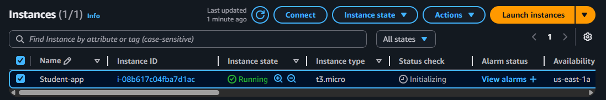
  

 Step 2: Connect to your EC2 instance copy ssh coomand and paste it in git bash.

 1.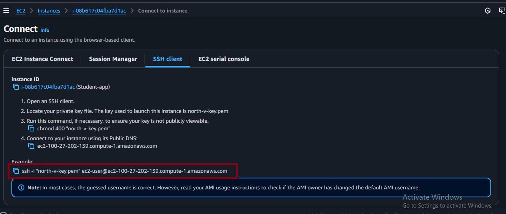
 2.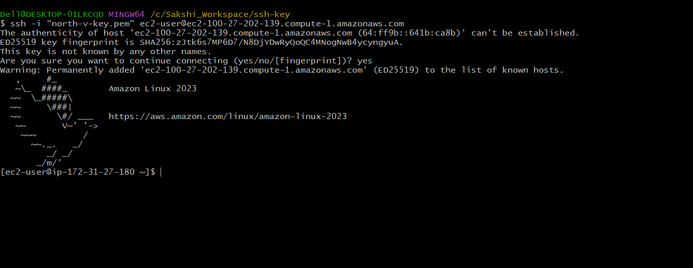

 Step 3: Automating the LAMP stack installation with LAMP.sh script.
 
 1.Create Lamp.sh
 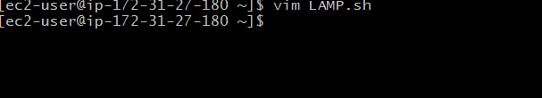
 2. Insert the code for installing apache, mysql and php (LAMP)

    sudo yum update
    sudo yum install httpd mariadb105-server php-y
    sudo systemctl start httpd mariadb php-fpm
    sudo systemctl enable httpd mariadb php-fpm
    sudo echo"<h1>welcome</h1>"
    /var/www/html/index.html
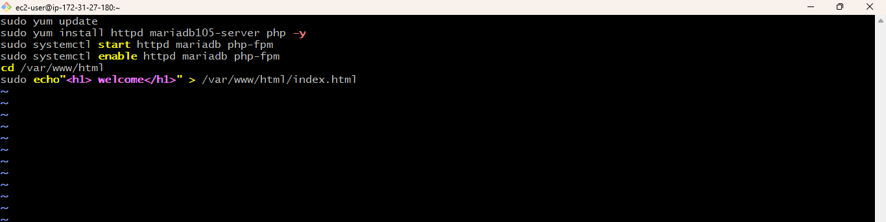
3. Check the status of apache, mysql and php
 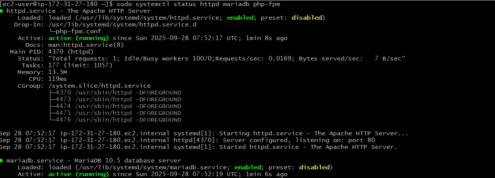 
 4. Change directory to Default directory
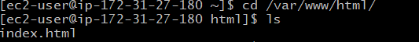 
Step 4: Creating Signup Page

    sudo vim signup.html
 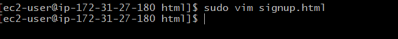   

   - Code of Signup.html
  
 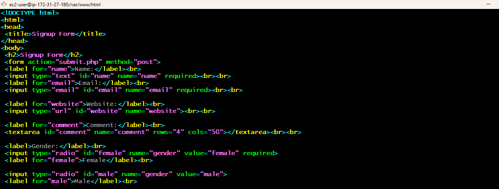

 Step 5: Configure the Database (MariaDB) 

   1.Generate the Username and Password.
   
    sudo mysql
    alter user root@localhost identified by'root';
   2.Login to Mysql (mariadb105-server) 
   sudo mysql -u root -p
   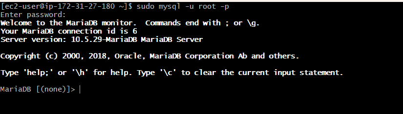
   3.Create Database

      # to create database
      create database FCT;
      # to see all databases
      show databases;
      # to use that database
      use FCT;
   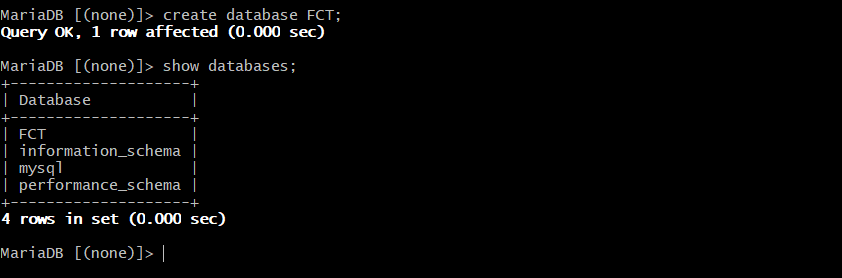
  4.Creating table according to the signup form

     CREATE TABLE users (
     id INT PRIMARY KEY AUTO_INCREMENT,
     name VARCHAR(20),
     email VARCHAR(100),
     website VARCHAR(255),
     gender VARCHAR(6),
     comment VARCHAR(100));
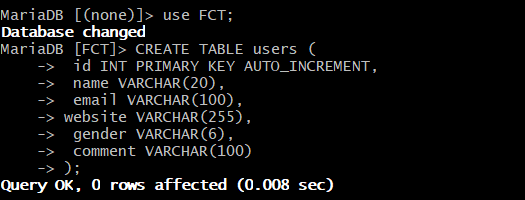
5.Describe the table

    desc users;
  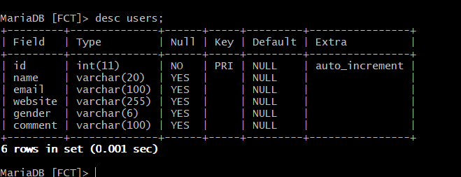
Step 6: Connect Form to Database with submit.php

1. Create the file submit.php
   
       sudo vim submit.php
  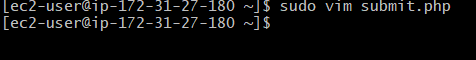
 2.Code of submit.php
 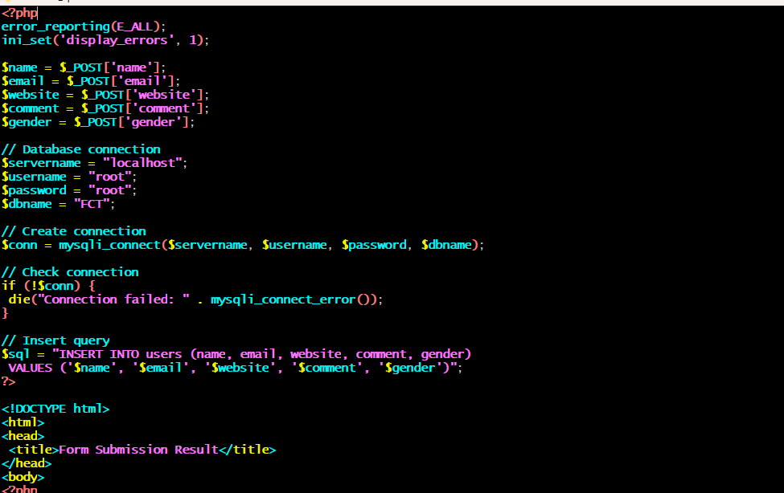 
 Step 7: Install PHP-MSQL Connector

       sudo yum install php8.4-mysqlnd.x86_64
  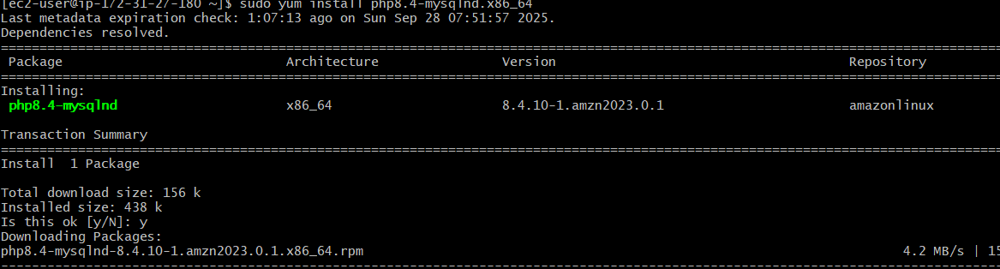

  Step 8: Restart the Services

      sudo systemctl restart httpd mariadb php-fpm 
  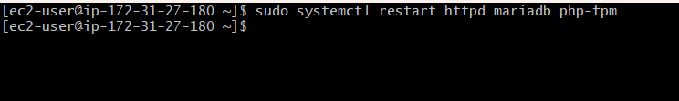        

  Step 8: Deploy and Test the Signup form

  - Copy the Public IP and Paste it in any browser.
 
  1.Signup.html
  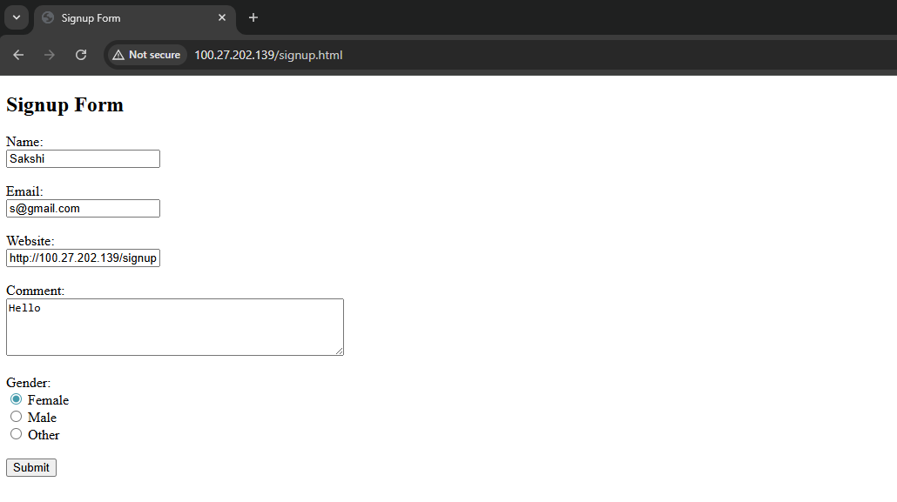

  2.Submit.php

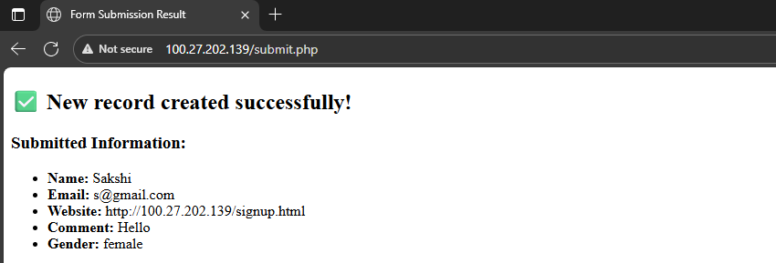

### Summary:
In this project, deployed a PHP-based signup form on an AWS EC2 instance by setting up a complete LAMP stack (Linux, Apache, MariaDB, PHP). Automated the LAMP installation with a custom lamp.sh script, created a signup form (signup.html), and connected it to a MariaDB database using a backend script (submit.php). The PHP-MySQL connector was installed to enable communication between PHP and MariaDB. Finally, tested the application in a browser and verified that user data was successfully stored in the database.